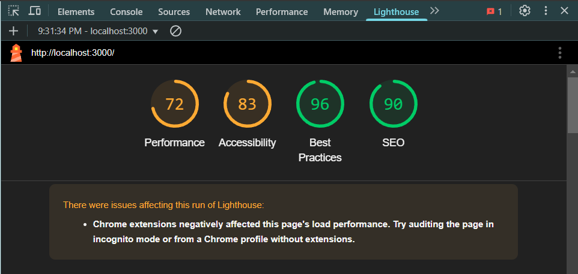

> **Note :** Lighthouse a relevé des problèmes affectant ce run de Lighthouse.  
> Les extensions Chrome ont négativement impacté le temps de chargement de la page.  
> Essayez d'auditer la page en mode incognito ou avec un profil Chrome sans extensions.
> Donc, j'ai ouvert <http://localhost:3000/> dans une fenêtre incognito de Chrome, et les résultats sont complètement différents.
---

  

# Suggestions d'améliorations – Rapport Lighthouse pour l'application de gestion de contacts

Après avoir passé l'appli au test Lighthouse, j'ai vu plusieurs points à améliorer. Voici quelques suggestions basées directement sur les résultats du rapport, pour rendre l'appli plus rapide, accessible et bien optimisée pour le SEO.

---

## Performance

- **Éliminer les ressources qui bloquent le rendu**  
  *Problème Lighthouse* :  
  > "Resources are blocking the first paint of your page. Consider delivering critical JS/CSS inline and deferring all non-critical JS/styles."  
  **Suggestion** : Intégrer le CSS/JS critiques directement dans le HTML ou charger les ressources non essentielles en différé pour que le contenu s'affiche plus rapidement.

- **Activer la compression du texte**  
  *Problème Lighthouse* :  
  > "Enable text compression — Potential savings of 2 KiB"  
  **Suggestion** : Configurer le serveur pour compresser les fichiers textuels (gzip, etc) afin de réduire la taille des transferts.

- **Minifier mes fichiers CSS et JavaScript**  
  *Problème Lighthouse* :  
  > "Minify CSS" et "Minify JavaScript"  
  **Suggestion** : Minifier et nettoyer mes fichiers CSS/JS pour réduire leur taille et accélérer le téléchargement et l'exécution.

- **Optimiser les images**  
  *Problème Lighthouse* :  
  > "Serve images that are appropriately-sized", "Efficiently encode images", "Serve images in next-gen formats"  
  **Suggestion** : Convertir mes images aux formats WebP ou AVIF et ajuster leurs dimensions pour améliorer le temps de chargement.

- **Réduire la taille du DOM**  
  *Problème Lighthouse* :  
  > "Avoids an excessive DOM size — 17 elements"  
  **Suggestion** : Simplifier la structure HTML pour réduire le nombre d'éléments inutiles et ainsi alléger le travail du navigateur.

- **Réduire la chaîne des requêtes critiques**  
  *Problème Lighthouse* :  
  > "Avoid chaining critical requests — 1 chain found"  
  **Suggestion** : Revoir l'ordre de chargement des ressources critiques afin de diminuer la latence et accélérer le rendu de la page.

---

## Accessibilité

- **Améliorer le contraste des couleurs**  
  *Problème Lighthouse* :  
  > "Background and foreground colors do not have a sufficient contrast ratio."  
  **Suggestion** : Ajuster les couleurs de fond et du texte pour assurer un contraste suffisant, facilitant ainsi la lecture pour tous, notamment pour les personnes malvoyantes.

- **Associer correctement les labels aux champs de formulaire**  
  *Problème Lighthouse* :  
  > "Form elements have associated labels"  
  **Suggestion** : M'assurer que chaque champ de formulaire possède un label clair ou un attribut ARIA approprié pour que l'information soit accessible aux lecteurs d'écran.

- **Optimiser l'ordre de tabulation et la gestion du focus**  
  *Problème Lighthouse* :  
  > "The page has a logical tab order"  
  **Suggestion** : Organiser l'ordre du DOM pour que la navigation au clavier soit intuitive et que tous les éléments interactifs soient facilement accessibles.

---

## Bonnes pratiques

- **Utiliser HTTP/2**  
  *Problème Lighthouse* :  
  > "Uses HTTP/2"  
  **Suggestion** : Configurer le serveur pour utiliser HTTP/2 afin de bénéficier du multiplexage des requêtes et améliorer la vitesse de chargement.

- **Minifier et nettoyer mes fichiers JS/CSS**  
  *Problème Lighthouse* :  
  > "Minify JavaScript", "Remove duplicate modules in JavaScript bundles"  
  **Suggestion** : Minifier et optimiser mes fichiers pour réduire la taille des bundles et accélérer l'exécution du code.

- **Précharger les ressources critiques**  
  *Problème Lighthouse* :  
  > "Preload Largest Contentful Paint image"  
  **Suggestion** : Utiliser des balises `<link rel="preload">` pour les ressources essentielles afin d'améliorer le Largest Contentful Paint (LCP).

---

## SEO

- **Ajouter une meta description**  
  *Problème Lighthouse* :  
  > "Document does not have a meta description"  
  **Suggestion** : Ajouter une balise `<meta name="description" content="Description de l'appli...">` pour résumer le contenu et améliorer l'indexation par les moteurs de recherche.

- **Optimiser le titre et l'attribut lang**  
  *Problème Lighthouse* :
    > "Document has a `<title>` element", "`<html>` element has a [lang] attribute"
  **Suggestion** : Utiliser un titre clair et définir l'attribut `lang` (par exemple `<html lang="fr-CA">`) pour améliorer le référencement et l'accessibilité.

- **Utiliser des liens descriptifs**  
  *Problème Lighthouse* :  
  > "Links have descriptive text"  
  **Suggestion** : S'assurer que tous les liens contiennent un texte explicite et informatif, facilitant ainsi leur compréhension par les utilisateurs et les moteurs de recherche.

---

Ces propositions sont basées directement sur les points soulevés par Lighthouse et visent à optimiser la performance, l'accessibilité, les bonnes pratiques et le référencement de l'appli.

---

Source: [Accessibility Scoring – Chrome Developers](https://developer.chrome.com/docs/lighthouse/accessibility/scoring)
